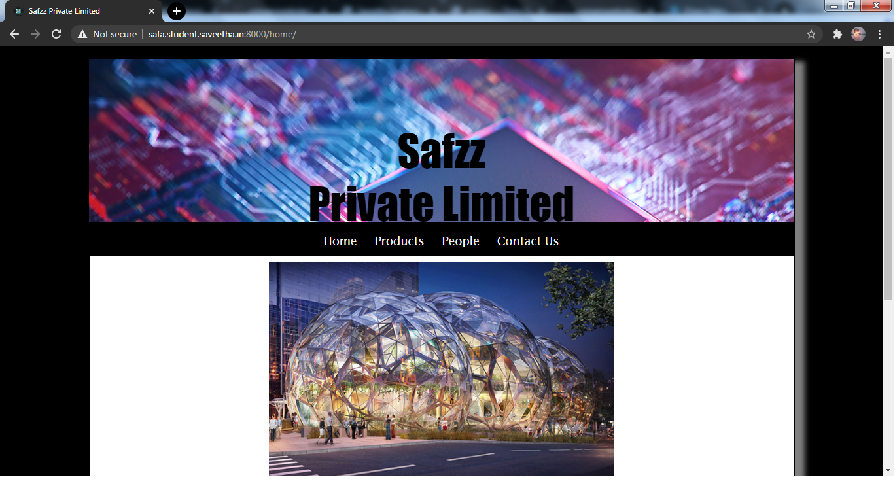
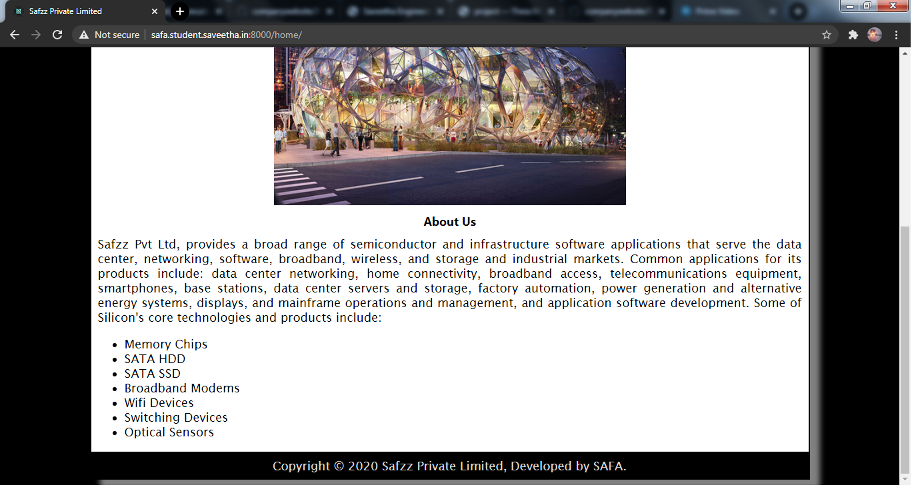
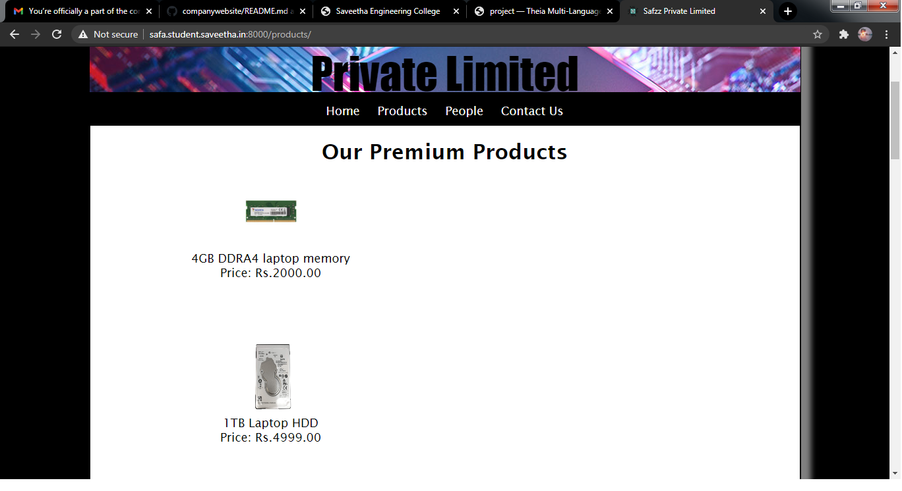
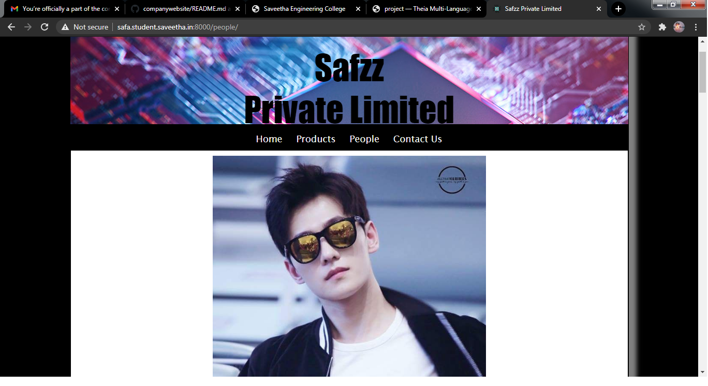
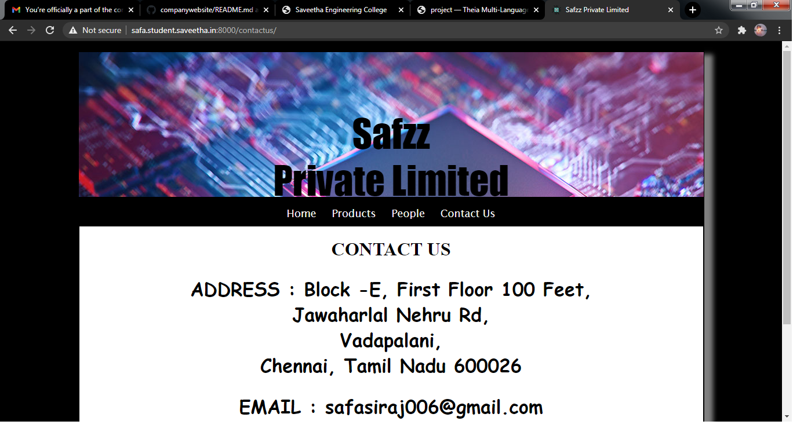
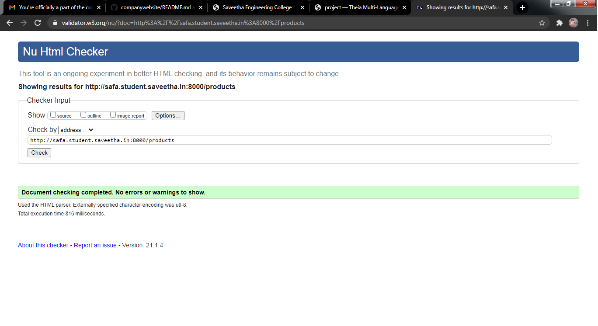

# Web Design for a Manufacturing Company
## AIM: 
To design a static website for a chip manufacturing company.

## DESIGN STEPS:
### Step 1: 
Requirement collection.
### Step 2:
Creating the layout using HTML and CSS.
### Step 3:
Updating the sample content.
### Step 4:
Choose the appropriate style and color scheme.
### Step 5:
Validate the layout in various browsers.
### Step 6:
Validate the HTML code.
### Step 6:
Publish the website in the given URL.

## PROGRAM:

### base.html
```

<!DOCTYPE html>
<html lang="en">

<head>
    <title>Safzz Private Limited</title>
    <link rel="stylesheet" href="">
    <link rel = "icon" href ="" type = "image/x-icon"> 
              
</head>

<body>
    <div class="container">
    <div class="banner">
        Safzz <br/>
        Private Limited
    </div>
    <div class="menu">
        <div class="menuitem"><a href="/home">Home</a></div> 
        <div class="menuitem"><a href="/products">Products</a></div> 
        <div class="menuitem"><a href="/people">People</a></div>
        <div class="menuitem"><a href="/contactus">Contact Us</a></div> 
    </div><div class="content">
        
    
    </div>
    <div class="footer">
        Copyright © 2020 Safzz Private Limited, Developed by SAFA.
    </div>
    </div>

    
</body>

</html>
```

### home.html
```



    <div class="homecontent">    

    
    <h1>About Us</h1>
    <div class="contenttext">
    Safzz Pvt Ltd, provides a broad range of semiconductor and infrastructure software applications that serve the data center, networking, software, broadband, wireless, and storage and industrial markets. Common applications for its products include: data center networking, home connectivity, broadband access, telecommunications equipment, smartphones, base stations, data center servers and storage, factory automation, power generation and alternative energy systems, displays, and mainframe operations and management, and application software development. Some of Silicon's core technologies and products include:
    <ul>
        <li>Memory Chips</li>
        <li>SATA HDD</li>
        <li>SATA SSD </li>
        <li>Broadband Modems</li>
        <li>Wifi Devices</li>
        <li>Switching Devices</li>
        <li>Optical Sensors</li>
    </ul> 
    </div>
    </div>

```
### products.html
```



     <div class="productcontent">    
    <h1>Our Premium Products</h1>
    <div class="productitems">
        <div class="productitem"> 
            <div class="itemimage">
            
            </div>
            <div class="itemname">4GB DDRA4 laptop memory</div>
            <div class="itemprice">Price: Rs.2000.00 </div>
        </div>
        <div class="productitem"> 
            <div class="itemimage">
            
            </div>
            <div class="itemname">1TB Laptop HDD</div>
            <div class="itemprice">Price: Rs.4999.00 </div>
        </div>
        <div class="productitem"> 
            <div class="itemimage">
            
            </div>
            <div class="itemname">WIFI modem</div>
            <div class="itemprice">Price: Rs.999.00 </div>
        </div>
        <div class="productitem"> 
            <div class="itemimage">
            
            </div>
            <div class="itemname">Sandisk 128GB memory card</div>
            <div class="itemprice">Price: Rs.1999.00 </div>
        </div>
        <div class="productitem"> 
            <div class="itemimage">
            
            </div>
            <div class="itemname">Portable wifi 4G</div>
            <div class="itemprice">Price: Rs.3999.00 </div>
        </div>
        <div class="productitem"> 
            <div class="itemimage">
            
            </div>
            <div class="itemname">Fingerprint Sensor</div>
            <div class="itemprice">Price: Rs.1799.00 </div>
        </div>
        <div class="productitem"> 
            <div class="itemimage">
            
            </div>
            <div class="itemname">Blood pressure Monitor</div>
            <div class="itemprice">Price: Rs.1949.00 </div>
        </div>
        <div class="productitem"> 
            <div class="itemimage">
            
            </div>
            <div class="itemname">Dust sensor</div>
            <div class="itemprice">Price: Rs.599.00 </div>
        </div>
        <div class="productitem"> 
            <div class="itemimage">
            
            </div>
            <div class="itemname">Portable hardrive</div>
            <div class="itemprice">Price: Rs.4299.00 </div>
        </div>
        <div class="productitem"> 
            <div class="itemimage">
            
            </div>
            <div class="itemname">Internal Hard drive</div>
            <div class="itemprice">Price: Rs.4999.00 </div>
        </div>
        <div class="productitem"> 
            <div class="itemimage">
            
            </div>
            <div class="itemname">WD my passport SSD</div>
            <div class="itemprice">Price: Rs.9999.00 </div>
        </div>
        <div class="productitem"> 
            <div class="itemimage">
            
            </div>
            <div class="itemname">Desktop memory</div>
            <div class="itemprice">Price: Rs.3999.00 </div>
        </div>
    


        
    </div>
    </div>

```
### people.html
```



<div class="peoplecontent"> 
    
       <h1>  YANG YANG </h1>
        <h1>CEO</h1>

     
     <h1>  SONG JOONG KI </h1> <h1>CFO </h1>

    
       <h1>  LI XIAN </h1><h1>COO</h1>

    
       <h1>  LEE MIN HO</h1><h1>CTO</h1>

    
       <h1>  KIM SOO HYUN</h1><h1>CMO</h1>

    
       <h1>  LEE JONG SUK</h1><h1>PRESIDENT</h1>

</div>

```
### contactus.html
```



<div class="contactcontent"> 
<h1>CONTACT US </h1>
<h2>ADDRESS :  
       Block -E, First Floor 100 Feet,<br>   Jawaharlal Nehru Rd,<br> Vadapalani,<br> Chennai, Tamil Nadu 600026</h2>
<h2>EMAIL :  safasiraj006@gmail.com</h2>
<h2>Phone :   9962102129</h2>
</div>

```

## OUTPUT:










## CODE VALIDATION REPORT:





## RESULT:
Thus a website is designed for the chip manufacturing company and is hosted in the URL http://safa.student.saveetha.in:8000/home. HTML code is validated.